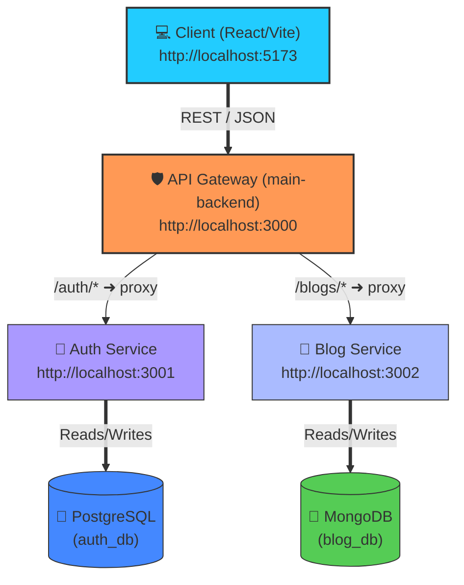

# 🌐 Microservices Learning & Development Workspace

Welcome to your Microservices workspace! This repository serves as a hands-on learning playground and template for building, testing, and orchestrating modern distributed applications. 

It contains a fully functional **Blogging Platform** structured as a set of containerized backend microservices, a centralized API Gateway, and a React frontend client.

---

## 🏗️ Architecture & Topology

The system uses an **API Gateway pattern** where the React client interacts solely with a single entrance point (`main-backend`), which dynamically forwards requests to isolated internal downstream services based on the routing rules.



---

## 📂 Workspace Structure

This monorepo leverages **npm workspaces** to manage multiple independent node packages from a single root configuration.

```directory
Microservices/                     # Workspace Root Directory
├── README.md                      # [THIS FILE] Workspace Overview & Quickstart
└── bloging/                       # Blogging Platform Application Folder
    ├── docker-compose.yml         # Containerized database orchestrator (Postgres, Mongo)
    ├── package.json               # Root workspaces configuration & launch scripts
    ├── .env.example               # Blueprint for environment variables
    ├── client/                    # React frontend application (Vite-powered)
    └── services/                  # Backend microservices
        ├── main-backend/          # API Gateway & Reverse Proxy (Express + HttpProxy)
        ├── auth-service/          # Authentication service (JWT, bcrypt, PostgreSQL client)
        └── blog-service/          # Content & Blog management service (Mongoose, MongoDB)
```

---

## ⚡ Technical Stack & Services Allocation

| Service / Component | Technology Stack | Port | Purpose / Role |
| :--- | :--- | :--- | :--- |
| **API Gateway** (`main-backend`) | Express, `http-proxy-middleware`, Helmet, Morgan | `3000` | Entrypoint, routing proxies, security headers, global request logging. |
| **Auth Service** (`auth-service`) | Express, JWT, BCrypt, PostgreSQL (`pg`) | `3001` | Handles user registration, credentials hashing, JWT generation & verification. |
| **Blog Service** (`blog-service`) | Express, MongoDB (`mongoose`) | `3002` | Manages blog post creation, read operations, database storage in MongoDB. |
| **Web UI** (`client`) | React, Vite | `5173` | Interactive frontend UI dashboard for registering, logging in, and reading/writing blogs. |
| **Postgres Database** | Docker (Image: `postgres:16-alpine`) | `5432` | Persistent storage for users credentials and access control databases. |
| **Mongo Database** | Docker (Image: `mongo:7`) | `27017` | Document database for unstructured blog posts data. |

---

## 🚀 Getting Started

Follow these step-by-step instructions to prepare, spin up, and run the entire application ecosystem locally.

### 📋 Prerequisites
Ensure you have the following installed on your host machine:
* **Node.js** (v18+ recommended)
* **Docker & Docker Compose**

---

### Step 1: Set Up Environment Variables
Navigate to the active application workspace `bloging` and duplicate the `.env.example` file to `.env`:

```bash
cd bloging
cp .env.example .env
```

Customize the database credentials and endpoints in `.env` if desired (defaults are preconfigured for local development).

---

### Step 2: Spin Up Database Containers
Start PostgreSQL and MongoDB in the background using Docker Compose:

```bash
docker compose up -d
```

Verify that the databases are healthy and running:
```bash
docker compose ps
```

---

### Step 3: Install Dependencies
Install all package dependencies for every workspace module simultaneously from the `bloging` directory:

```bash
npm run install:all
```

---

### Step 4: Run the Ecosystem
You can start all backend services and the frontend client simultaneously with a single command:

```bash
npm run dev
```

Alternatively, run specific components or groupings depending on your focus:

* **Start Backend services only** (Gateway, Auth, Blog):
  ```bash
  npm run dev:backend
  ```
* **Start Web Client only**:
  ```bash
  npm run dev:client
  ```
* **Start an individual backend service**:
  ```bash
  npm run dev:main   # For main-backend Gateway
  npm run dev:auth   # For Auth Service
  npm run dev:blog   # For Blog Service
  ```

---

## 📡 API Directory & Routes

### 🛡️ API Gateway (Main Entry Point: `http://localhost:3000`)
Every client request should target the gateway:

| Route Path | HTTP Method | Proxy Destination | Description |
| :--- | :--- | :--- | :--- |
| `/health` | `GET` | *Local (Gateway)* | Returns the health check of the gateway. |
| `/auth/register` | `POST` | `http://localhost:3001/register` | Registers a new user. |
| `/auth/login` | `POST` | `http://localhost:3001/login` | Logs in and returns a JWT token. |
| `/blogs` | `GET` | `http://localhost:3002/blogs` | Retrieves all blog posts. |
| `/blogs` | `POST` | `http://localhost:3002/blogs` | Creates a new blog post (Attach `Authorization: Bearer <token>`). |

### 🔒 Direct Service Endpoints (Internal Only)
For direct isolation testing, you can hit the internal microservices directly:

#### Authentication Service (`http://localhost:3001`)
* `GET  /health` - Check service status
* `POST /register` - Register body parameters (`username`, `password`)
* `POST /login` - Login body parameters (`username`, `password`)

#### Blog Service (`http://localhost:3002`)
* `GET  /health` - Check service status
* `GET  /blogs` - Fetch blog posts list
* `POST /blogs` - Create a blog post body parameters (`title`, `content`, `author`)

---

## 🛡️ Best Practices & Design Patterns Illustrated
This learning setup implements key microservices patterns:
1. **API Gateway Pattern**: Provides a single unified endpoint for frontend clients, masking the underlying microservices infrastructure, mitigating CORS issues, and enabling uniform routing.
2. **Database Per Service**: `auth-service` utilizes a relational PostgreSQL database while `blog-service` utilizes a NoSQL MongoDB document database, demonstrating polyglot persistence.
3. **Decoupled Workspaces**: The application directories are decoupled, allowing teams to work, deploy, and scale service modules independently.
