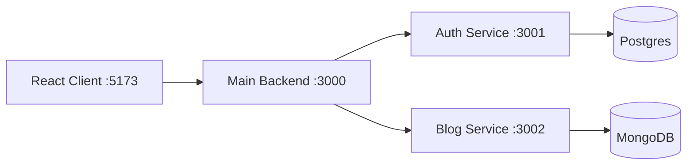

# Microservices Architecture Starter

This project contains three Node.js services:

- `main-backend` on port `3000`: gateway/backend entry point.
- `auth-service` on port `3001`: authentication service using Postgres.
- `blog-service` on port `3002`: blog service using MongoDB.
- `client` on port `5173`: React app for testing the backend.

## Architecture



## Setup

1. Copy the environment file:

   ```bash
   cp .env.example .env
   ```

2. Start databases:

   ```bash
   docker compose up -d
   ```

3. Install dependencies:

   ```bash
   npm install
   ```

4. Start all services:

   ```bash
   npm run dev
   ```

5. Open the client:

   ```text
   http://localhost:5173
   ```

## Useful Endpoints

Main backend:

- `GET http://localhost:3000/health`
- `POST http://localhost:3000/auth/register`
- `POST http://localhost:3000/auth/login`
- `GET http://localhost:3000/blogs`
- `POST http://localhost:3000/blogs`

Auth service:

- `GET http://localhost:3001/health`
- `POST http://localhost:3001/register`
- `POST http://localhost:3001/login`

Blog service:

- `GET http://localhost:3002/health`
- `GET http://localhost:3002/blogs`
- `POST http://localhost:3002/blogs`
